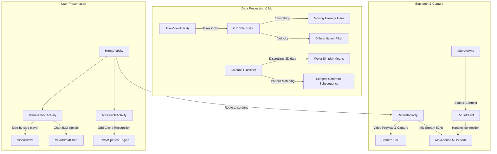

# SensorCator Repository Analysis Report

This report provides a comprehensive review of the **SensorCator** Android application repository ([llslim/SensorCator](https://github.com/llslim/SensorCator)), including its directory layout, component architecture, algorithmic workflows, and code quality findings.

---

## 1. Executive Summary
The **SensorCator** (app name **A11y**) is an Android accessibility tool built to record, manage, compare, and recognize hand gestures using wearable **Movesense IMU sensors** and phone camera feeds. It implements an Augmentative and Alternative Communication (AAC) dashboard, converting classified motion patterns into Text-to-Speech (TTS) voice commands.

---

## 2. Component Architecture
The application is structured into three main layers: **Bluetooth & Data Capture**, **Data Processing & ML**, and **User Presentation**.



---

## 3. Detailed Component Breakdown

### Core Modules and Activities

| File Path | Component Name | Responsibility |
| :--- | :--- | :--- |
| [MainActivity.java](file:///D:/Antigravity1x_backup/windows-projects/GestureFlow/app/src/main/java/com/tanujn45/a11y/MainActivity.java) | `MainActivity` | Initiates BLE scans for devices starting with `"Movesense"`. Stores previously connected devices in `SharedPreferences`. |
| [HomeActivity.java](file:///D:/Antigravity1x_backup/windows-projects/GestureFlow/app/src/main/java/com/tanujn45/a11y/HomeActivity.java) | `HomeActivity` | Main navigation hub displaying links to the Record, Accessible Gestures, Annotations, Visualizations, and Help activities. |
| [RecordActivity.java](file:///D:/Antigravity1x_backup/windows-projects/GestureFlow/app/src/main/java/com/tanujn45/a11y/RecordActivity.java) | `RecordActivity` | Captures parallel inputs: video files via CameraX (`rawVideos/`) and time-synchronized sensor data CSV files (`rawData/`). |
| [GestureCategoryActivity.java](file:///D:/Antigravity1x_backup/windows-projects/GestureFlow/app/src/main/java/com/tanujn45/a11y/GestureCategoryActivity.java) | `GestureCategoryActivity` | Manages categories (stored in `master.csv`). Sets folders for each category (e.g. `trimmedData/rest`). |
| [GestureInstanceActivity.java](file:///D:/Antigravity1x_backup/windows-projects/GestureFlow/app/src/main/java/com/tanujn45/a11y/GestureInstanceActivity.java) | `GestureInstanceActivity` | Details individual trials for a gesture category (via `master_[category].csv`). Integrates a TTS preview. |
| [VideoListActivity.java](file:///D:/Antigravity1x_backup/windows-projects/GestureFlow/app/src/main/java/com/tanujn45/a11y/VideoListActivity.java) | `VideoListActivity` | Displays recorded raw videos with thumbnails using `MediaMetadataRetriever` so the user can select files to label. |
| [TrimVideoActivity.java](file:///D:/Antigravity1x_backup/windows-projects/GestureFlow/app/src/main/java/com/tanujn45/a11y/TrimVideoActivity.java) | `TrimVideoActivity` | Trims videos and coordinates data alignment. Extracts the raw IMU data corresponding to the trimmed video interval. |
| [VisualizationActivity.java](file:///D:/Antigravity1x_backup/windows-projects/GestureFlow/app/src/main/java/com/tanujn45/a11y/VisualizationActivity.java) | `VisualizationActivity` | Plays two instance videos side-by-side while simultaneously plotting X/Y/Z sensor feeds on a single timeline. |
| [AccessibleActivity.java](file:///D:/Antigravity1x_backup/windows-projects/GestureFlow/app/src/main/java/com/tanujn45/a11y/AccessibleActivity.java) | `AccessibleActivity` | Serves as the user-facing AAC grid layout. Subscribes to the live sensor and feeds the stream to the K-Means classifier. |

---

## 4. Key Workflows and Algorithms

### A. Sensor & Video Synchronization
During recording in `RecordActivity`, the sensor clock is synchronized to Unix time via the Movesense MDS PUT contract on the `/Time` path:
`getMds().put(timeUri, payload, ...)`
When raw data is recorded, each sample's timestamp is formatted:
`timestamp + index * 20L` (approx. 50Hz, corresponding to a 20ms step interval). This timestamp matching allows `TrimVideoActivity` to precisely crop the IMU CSV rows when a user crops the raw `.mp4` file.

### B. Signal Preprocessing & Cleaning (`CSVFile`)
The [CSVFile.java](file:///D:/Antigravity1x_backup/windows-projects/GestureFlow/app/src/main/java/com/tanujn45/a11y/CSVEditor/CSVFile.java) helper is responsible for preparing sensor records:
* **Smoothing (`applyMovingAverage`)**: Applies a simple moving average (sliding window of size 2) over the `acc_x`, `acc_y`, and `acc_z` raw parameters to suppress jitter.
* **Velocity Estimation (`applyDifferentiation`)**: Computes discrete derivatives ($a_{t} - a_{t-1}$) to track velocity changes.

### C. Gesture Classification Strategy (`KMeans`)
The classifier maps continuous 3D motion channels to discrete classification outputs:
1. **Symbolic Quantization**: The raw, moving-average, and differentiated channels are grouped into 3D vectors (`x, y, z`). Weka's `SimpleKMeans` model clusters these vectors into a sequence of $N=20$ discrete "cluster IDs" (analogous to visual words).
2. **Sequence Matching (LCS)**: The sequence of cluster IDs is compared against template sequences stored in the database. Similarity is evaluated using the **Longest Common Subsequence (LCS)** algorithm:
   ```java
   private double normSim(List<Integer> cluster1, List<Integer> cluster2) {
       double lcs = this.longestCommonSubsequence(cluster1, cluster2);
       return lcs / Math.max(cluster1.size(), cluster2.size());
   }
   ```
3. **Weight Calibration**: The final confidence score is a weighted sum of similarities across channels, controlled by weights defined in custom model profiles.

---

## 5. Key Findings and Code Issues

> [!WARNING]
> ### 1. Syntax Typo in Class Declaration
> Inside [GestureCategoryActivity.java](file:///D:/Antigravity1x_backup/windows-projects/GestureFlow/app/src/main/java/com/tanujn45/a11y/GestureCategoryActivity.java#L24), there is a syntax error in the class signature:
> `public class git add GestureCategoryActivity extends AppCompatActivity {`
> The prefix `"git add "` causes a compiler failure. This must be refactored to `public class GestureCategoryActivity extends AppCompatActivity {` to build the app.

> [!NOTE]
> ### 2. Bypassed BLE Scanning
> In [MainActivity.java](file:///D:/Antigravity1x_backup/windows-projects/GestureFlow/app/src/main/java/com/tanujn45/a11y/MainActivity.java#L74-L78), the BLE scanning page is bypassed:
> ```java
> // bypass for testing
> Intent intent = new Intent(this, HomeActivity.class);
> startActivity(intent);
> finish();
> return;
> ```
> This bypass redirects users directly to `HomeActivity` upon startup, preventing BLE scanning unless they navigate back to connection pages.

> [!IMPORTANT]
> ### 3. MediaPipe Landmark Export
> The application contains a partially commented out MediaPipe routine (`processVideosAndGenerateCSV` inside `TrimVideoActivity.java`). When active, it uses Google's `HandLandmarkerHelper` to extract 21 coordinates $(x, y, z)$ per frame and output a `*_handlandmarkerFile1234.csv` matrix. This indicates plans for combining computer-vision-based skeletal models with IMU patterns.
